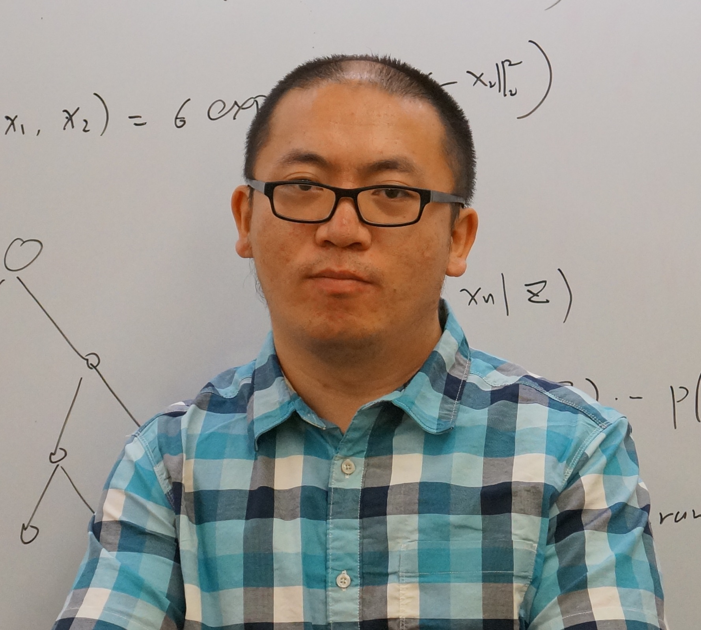
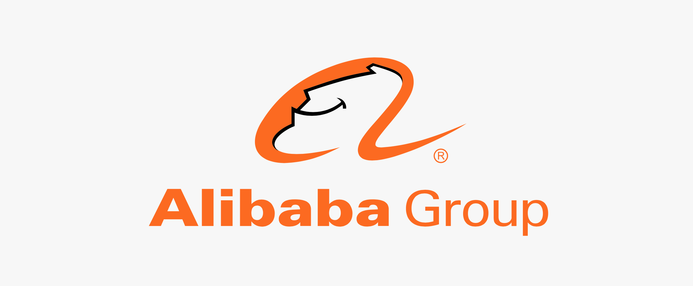

 

Website for dlp-kdd2019 can be found **[here](https://dlp-kdd.github.io/dlp-kdd2019)**

## Introduction

In the increasingly digitalized world, it is of utmost importance for various applications to harness the ability to process, understand, and exploit data collected from the Internet. For instance, in customer-centric applications such as personalized recommendation, online advertising, and search engines, interest/intention modeling from customers’ behavioral data can not only significantly enhance user experiences but also greatly contribute to revenues. Recently, we have witnessed that Deep Learning-based approaches began to empower these internet- scale applications by better leveraging the massive data. However, the data in these internet-scale applications are high dimensional and extremely sparse, which makes it different from many applications with dense data such as image classification and speech recognition where Deep Learning-based approaches have been extensively studied. For example, the training samples of a typical click-through rate (CTR) prediction task often involve billions of sparse features, how to mine, model and inference from such data becomes an interesting problem, and how to leverage such data in Deep Learning could be a new research direction. The characteristics of such data pose unique challenges to the adoption of Deep Learning in these applications, including modeling, training, and online serving, etc. More and more communities from both academia and industry have initiated the endeavors to solve these challenges. This workshop will provide a venue for both the research and engineering communities to discuss the challenges, opportunities, and new ideas in the practice of Deep Learning on high-dimensional sparse data.

## Important Dates

- Submission deadline: ***May 20, 2020***
- Acceptance notification: June 15, 2020.
- Workshop date: August 24, 2020 (San Diego Convention Center, San Diego, California USA)

## Workshop Format and Schedule

Half day. We would like to hold a half-day workshop in order to have enough new ground to cover invited academic and industry talks with a focus on many deep learning related areas. The tentative program schedule includes the following components:

- Ten oral presentations from paper submissions for 15 minutes each
- A poster session if there are lots of submissions for 45 minutes
- Four invited talks with a mix of industry and academia for 1 hour each ! A panel discussion with 45 minutes

## Topics of Interest
Topics include but are not limited to deep learning based network architecture design, large scale deep learning training framework, high-performance online inference engine or toolkits that help breaking the black box of deep learning models, such as
- Large Scale User Response Prediction Modeling
- Representation Learning for High-dimensional Sparse Data
- Embedding techniques, manifold learning and dictionary learning
- User Behaviour Understanding
- Large Scale Recommendation and Retrieval System
- Model compression for industrial application
- Scalable, Distributed and Parallel Training System for Deep Learning
- High throughput and low latency real time Serving System
- Applications of transfer learning, meta learning for sparse data
- Auto Machine Learning, Auto feature selection
- Explainable deep learning for high dimensional data
- Data augmentation, Anomaly Detection for High-dimensional Sparse data
- Generative Adversarial Network for sparse data
- Other challenges encountered in real-world applications

## Call for papers
Submissions are invited on describing innovative research on real-world data systems and applications, industrial experiences and identification of challenges that deploy research ideas in practical applications. Work-in-progress papers are also encouraged.

Full-length papers (up to 9 pages) or extended abstracts (2-4 pages) are welcome. Submissions must be in PDF format and formatted according to the new [Standard ACM Conference Proceedings Template](https://www.acm.org/publications/proceedings-template). 

Reviews are not double-blind, and author names and affiliations should be listed. Please use the KDD official guidelines to format your paper.

All submissions can be made through EasyChair using the following link (Coming soon!)

If you have any questions about submissions or our workshop, please contact [*dlpkdd2019@gmail.com*](mailto:dlpkdd2019@gmail.com)

## Workshop Chairs

  

   
  <a href="https://scholar.google.com/citations?user=eUMnOc0AAAAJ&hl=en">Xiaoqiang Zhu</a>
  
Tech Lead of advertising group

  
Alibaba

  

  

   
   <a href="https://scholar.google.com/citations?user=r9JOIloAAAAJ&hl=en">Kuang-chih Lee</a>
  
Tech Lead of business intelligence group, AliExpress

  

  

   
<a href="https://scholar.google.com/citations?user=n_E0Bg4AAAAJ&hl=en">Guorui Zhou</a>
  
Algorithm expert of advertising group

  
Alibaba

  

  
  

   
  <a href="http://byeah.github.io">Biye Jiang</a>
  
Algorithm expert of advertising group

  
Alibaba

  

  

   
  <a href="https://www.cs.cmu.edu/~lxiong/">Liang Xiong</a>
  
Facebook AI Applied Research

  

  
  
Junlin Zhang

  
Tech Lead

  
Artificial Intelligence Laboratory, Sina Weibo

  

  

   
  <a href="http://wzhe.me/">Zhe Wang</a>
  
Tech Lead

  
Recommendation group, Roku

  

  

   
  <a href="http://www.zheng-wen.com/">Zheng Wen</a>
  
Research Scientist

  
DeepMind

  

  

  
  
Haishan Liu

  
Director of Engineering

  
Tencent

  

  

   
  <a href="http://www.saying.ren/">Kan Ren</a>
  
Microsoft Research

  

  

   
  <a href="http://ir.aiqingyao.org/home">Qingyao Ai</a>
  
Assistant Professor

  
University of Utah

  

  

   
  <a href="https://www.cs.utah.edu/~zhe/">Shandian Zhe</a>
  
Assistant Professor

  
University of Utah

  

  

   
  <a href="http://wnzhang.net">Weinan Zhang</a>
  
Assistant Professor

  
Shanghai Jiao Tong University

  

    

## Program Committee

- Zhijun Yin, Facebook
- Rui Li, JD.com
- [Ruiming Tang](https://scholar.google.com/citations?user=fUtHww0AAAAJ&hl=en), Noah’s Ark Lab, Huawei
- [Mingsheng Long](http://ise.thss.tsinghua.edu.cn/~mlong/), Tsinghua University
- Zhen Qin, Google
- [Min Zhang](http://www.thuir.cn/group/~mzhang/), Tsinghua University
- [Xipeng Qiu](https://xpqiu.github.io/en.html), Fudan University
- [Qi Zhang](http://jkx.fudan.edu.cn/), Fudan University
- Yin Lou, Ant Finance
- [Dheevatsa Mudigere](https://sites.google.com/site/dheevatsa/home), Facebook
- Mou Na, Alibaba
- Xiang Li, Alibaba
- Bibek Behera, IIT Bombay
- Han Zhu, Alibaba
- Jiwei Tan, Peking University
- Di Wu, Alibaba
- Junwei Pan, Yahoo
- Na Ma, Taobao
- Fei Sun, Alibaba
- [Junqi Jin](https://scholar.google.com/citations?user=cAuxh7UAAAAJ&hl=en), Alibaba
- Xiaofeng Yang, Alibaba
- Chen Xu, Peking University
- Tao Zhuang, Alibaba

## Sponsor

